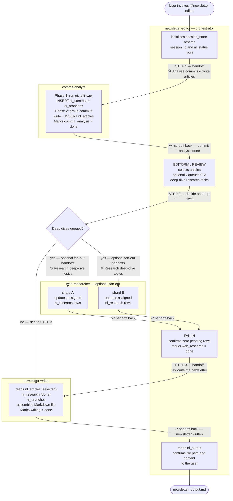

# Agent Interaction Flow

This document shows how the newsletter agents hand off work to each other.
Each agent is defined as a `.agent.md` file in this directory.

## Pipeline Overview



Parallelism note: when multiple deep-dive rows are queued in `nl_research`,
the editor splits them into explicit shards and passes each worker a bounded
`research_id` set. Workers update only their assigned rows. `web_research` is
marked `done` only after fan-in confirms zero pending rows remain.

## State machine (`nl_status`)

All stages are tracked in `session_store`:

| Stage             | Set by          | Meaning                            |
|-------------------|-----------------|------------------------------------|
| `commit_analysis` | commit-analyst  | Git data collected + articles done |
| `web_research`    | web-researcher  | Deep-dive summaries written        |
| `writing`         | newsletter-writer | Final Markdown assembled         |

Each stage follows the lifecycle: `pending` → `done | failed | skipped`.

Status semantics:

- `done`: stage completed successfully.
- `failed`: stage hit a terminal error and requires operator intervention
        or a targeted rerun.
- `skipped`: stage intentionally not run (for example, `web_research` when
        no deep-dive rows are queued).

Terminal behavior:

- If any required stage (`commit_analysis`, `writing`) is `failed`, the run is
        terminal and should not proceed to finalisation.
- If `web_research` is `skipped`, the pipeline may proceed directly to
        `writing`.
- Orchestrator polling should tolerate transient tool/database failures with
        short retries before marking a stage `failed`.

## Handoff summary

| From                | To                  | Trigger                              |
|---------------------|---------------------|--------------------------------------|
| newsletter-editor   | commit-analyst      | Pipeline start                       |
| commit-analyst      | newsletter-editor   | `commit_analysis` = done             |
| newsletter-editor   | web-researcher      | Deep-dive shard queued with explicit `research_id` ownership |
| web-researcher      | newsletter-editor   | Assigned shard completed; stage may be `done` only after fan-in |
| newsletter-editor   | newsletter-writer   | Articles selected, research done     |
| newsletter-writer   | newsletter-editor   | `writing` = done                     |

## Session store schema

```
nl_sessions   ← one row per pipeline run (repo, branch, period)
nl_commits    ← raw commit data (collected by commit-analyst, phase 1)
nl_branches   ← branch activity and stale-branch data
nl_articles   ← newsletter articles (written by commit-analyst, phase 2)
nl_research   ← deep-dive research tasks and results
nl_output     ← final assembled newsletter Markdown
nl_status     ← stage progress flags (commit_analysis | web_research | writing)
```
