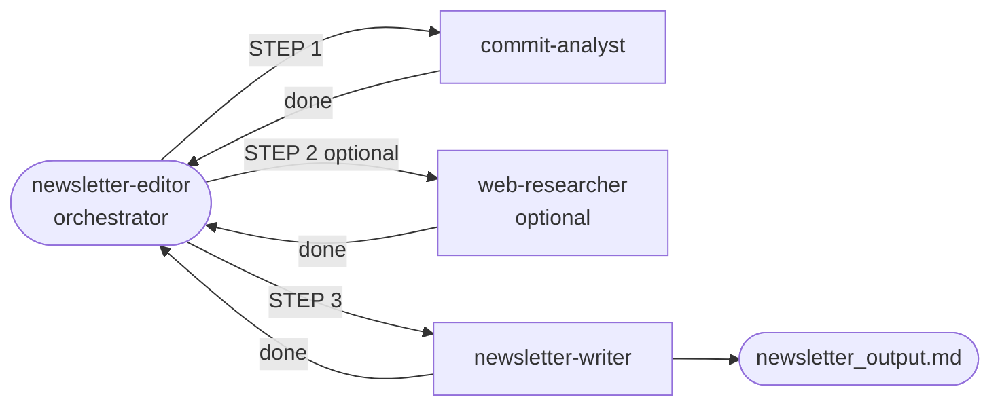

# Git Newsletter Toolkit

The main interface is an AI agent called `newsletter-editor`.
It analyzes a repository and produces newsletter markdown as output.

## Main idea

1. Run Copilot CLI with `--agent "newsletter-editor"`.
2. Pass either a direct prompt or a profile prompt file reference.
3. The agent orchestrates specialist agents to collect git activity, draft
   articles, optionally research deep dives, and assemble final markdown.
4. The main artifact is a markdown newsletter file.

Flow reference: see [`.github/FLOW.md`](.github/FLOW.md).

## Agent workflow (simplified)



- [`newsletter-editor`](.github/agents/newsletter-editor.agent.md) is the orchestrator and entrypoint.
- [`commit-analyst`](.github/agents/commit-analyst.agent.md) gathers git data and writes article drafts.
- `newsletter-editor` selects what to include and optionally queues research.
- [`web-researcher`](.github/agents/web-researcher.agent.md) fills research sidebars when queued.
- [`newsletter-writer`](.github/agents/newsletter-writer.agent.md) assembles final newsletter markdown.
- `newsletter-editor` returns the final output path/content.

## Python setup

Use Python 3.11+.

### Option A — venv (standard Python tooling)

Create a venv once and activate it:

```bash
python3 -m venv .venv
source .venv/bin/activate       # Windows: .venv\Scripts\activate
pip install -r requirements.txt # or: pip install markdown css-inline python-dotenv gitpython jinja2
```

Then run the scripts directly:

```bash
python build_email.py --help
python send_email.py --help
python generate_examples.py
```

### Option B — uv (zero-setup, dependency-isolated)

Install `uv`: https://docs.astral.sh/uv/getting-started/installation/

```bash
uv run build_email.py --help
uv run send_email.py --help
uv run generate_examples.py
```

`uv` reads the `# /// script … # ///`
[PEP 723](https://peps.python.org/pep-0723/) block at the top of each script,
installs the required packages into an isolated cache on first run, and reuses
that cache on subsequent runs — no venv activation required.

### Option C — uv sync (shared venv for IDE tooling)

To get IDE auto-complete and to make `gitpython` available for the
commit-analysis skill, create a shared venv once with:

```bash
uv sync
source .venv/bin/activate  # Windows: .venv\Scripts\activate
```

`pyproject.toml` lists all project dependencies and is the single source of
truth for `uv sync`.

The agents (especially commit analysis) execute Python helpers under
`.github/skills/`, so `gitpython` must be importable in the agent's Python
environment — any of the options above covers this.

## Quickstart (Copilot CLI)

Prerequisites:

- Copilot CLI installed and authenticated
- Use `--experimental` when invoking Copilot CLI to enable session database support
- Git access to target repository URL/path

Direct prompt:

```bash
copilot --experimental -p "Create a concise weekly engineering newsletter from https://github.com/microsoft/vscode.git. Use branch main, cover the last 7 days, title it Dev Weekly, and write the final markdown to vscode-weekly-newsletter.md." --agent "newsletter-editor" --yolo
```

Prompt profile file with additional instructions:

```bash
newsletter_markdown=$(copilot --experimental -p "Use profile prompt file .github/prompts/profiles/examples/example-flask-monthly.prompt.md.
Generate a maintainers-focused monthly digest. Respond with only the final newsletter markdown content." --agent "newsletter-editor" --yolo)

printf '%s\n' "$newsletter_markdown" > flask-monthly-newsletter.md
```

Available profile prompts:

- `.github/prompts/profiles/TEMPLATE.prompt.md`
- `.github/prompts/profiles/examples/example-vscode-weekly.prompt.md`
- `.github/prompts/profiles/examples/example-kubernetes-weekly.prompt.md`
- `.github/prompts/profiles/examples/example-flask-monthly.prompt.md`

Run utility scripts with (activate your venv first, or prefix with `uv run`):

```bash
python build_email.py --help
python send_email.py --help
python generate_examples.py
```

## Extra scripts (after markdown is generated)

These scripts do not call Copilot. They are optional post-processing tools.

1. Markdown/CSS to HTML:

```bash
python build_email.py \
  --markdown samples/email/example_input.md \
  --style assets/email/styles/01-clean-blue.css \
  --output preview_output/ready_to_send.html
```

2. Generate all preview examples:

```bash
python generate_examples.py
```

Open `preview_output/generated_html/index.html` in your browser and click through the generated files.

3. Send over SMTP (optional):

```bash
python send_email.py \
  --html preview_output/ready_to_send.html \
  --markdown samples/email/example_input.md \
  --to recipient@example.com \
  --subject "Automated Markdown Newsletter"
```

Pass `--markdown` to include the Markdown source as the plain text alternative alongside the HTML body. Omit it to fall back to a minimal "Please enable HTML" placeholder.
